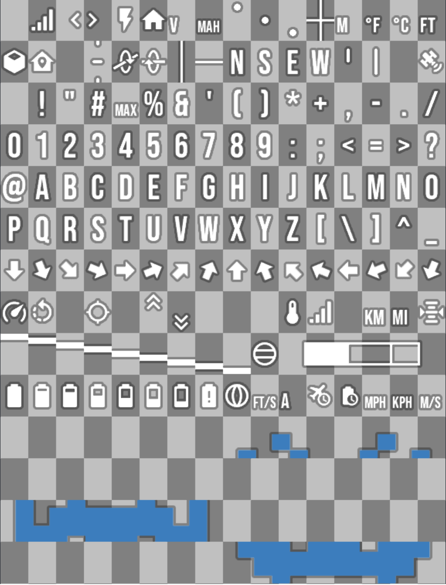

# Material OSD Font

This is a font for [fpv-wtf's msp-osd](https://github.com/fpv-wtf/msp-osd) using nice Material
Design icons! Currently, **only Betaflight** is supported.

## Installation

1. Grab the latest release from the [releases page](https://github.com/Knifa/material-osd/releases).
2. Unzip all `.bin` files to the root of your goggle's SD card.
3. Enjoy!

## License

The generator is licensed under [GNUv 3](./LICENSE.md). The generated fonts are licensed under
[CC-BY-SA 4.0](https://creativecommons.org/licenses/by-sa/4.0/).
